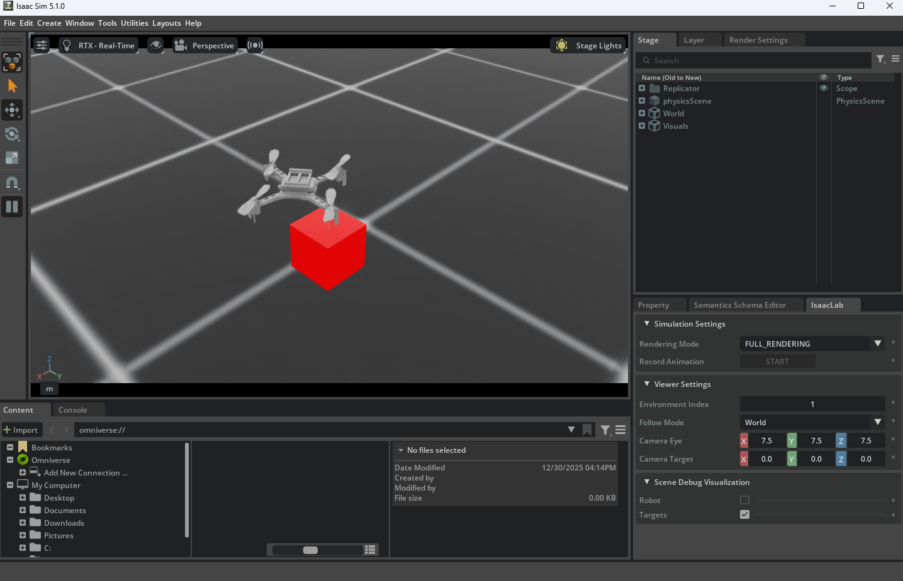

# 🤖 RL Environments: Search & Rescue Drone Curriculum

This directory contains the Reinforcement Learning (RL) environments designed for the SAR Drone project. The training pipeline is built on **Isaac Lab** and follows a strict **Curriculum Learning** approach, evolving from basic attitude control to complex, long-horizon active search missions.

The ultimate goal is to train a robust policy capable of **Sim-to-Real** transfer, deploying autonomous rescue agents on physical Crazyflie 2.1 hardware.

---

## 🚁 The Platform: Crazyflie 2.1

<em>Simulated model of the Crazyflie 2.x in Isaac Lab.</em>

The **Crazyflie 2.1** is a nano-quadcopter (27g) developed by [Bitcraze](https://www.bitcraze.io/). We simulate its rigid body dynamics and control the motors directly via a custom mixer, replacing classic PID cascades with end-to-end Neural Networks.

### Technical Specifications

| Property | Value | Notes |
| --- | --- | --- |
| **Weight** | 27 g | Modeled with high-fidelity inertia. |
| **Size** | 92 mm | Motor-to-motor (diagonal). |
| **Actuation** | 4 × DC Motors | Modeled as force/torque actuators. |
| **Sim Freq** | 100 Hz | Physics integration step. |
| **Control Freq** | 50 Hz | Decimation = 2 (Policy update rate). |

---

## 📂 Project Structure (Curriculum Stages)

The project is divided into four incremental phases. The policy weights are typically transferred from one stage to the next to accelerate convergence.

### 1️⃣ Phase 1: Stabilization (`/quadcopter`)

**Goal:** Flight Dynamics & Hover.

* **Task:** Stabilize random initial rotations and reach a target coordinate in empty space.
* **Key Feature:** Introduces **Zero-Padding (98 dims)** in the observation space to allow seamless architecture transfer to downstream tasks.
* **Outcome:** A policy that understands the basic physics of the drone.

### 2️⃣ Phase 2: Obstacle Avoidance (`/quadcopter_obstacles`)

**Goal:** Local Perception & Safety.

* **Task:** Navigate through a procedurally generated forest of pillars to reach sequential waypoints.
* **Innovation:** Implements **Body-Frame Sensing** (relative vectors to nearest obstacles) instead of heavy Lidar point clouds.
* **Refinement:** Includes a "Safety Fine-Tuning" stage that penalizes velocity vectors directed at obstacles ().

### 3️⃣ Phase 3: Long-Horizon Patrol (`/quadcopter_patrol`)

**Goal:** Navigation Consistency & Path Memorization.

* **Task:** Execute a complex **24-waypoint spiral pattern** covering a 30x30m area.
* **Environment:** **Deterministic Forest (Seed 42)**. The obstacle layout is fixed, forcing the agent to learn/overfit the optimal trajectory through the specific geometry.
* **Reward:** Layered curriculum bonuses (rewards increase as the drone pushes to outer spiral layers).

### 4️⃣ Phase 4: Active SAR (`/quadcopter_sar`)

**Goal:** Autonomous Victim Detection.

* **Task:** Locate 8 randomly scattered victims within the known forest.
* **Logic:** **Blind Search**. The agent does *not* know where victims are; it must rely on the optimized patrol path learned in Phase 3 to statistically guarantee coverage.
* **Feedback:** Visual debugging system (Red = Undetected, Green = Rescued) and sparse detection rewards ().

---

## ⚙️ Technical Environment Details

### 🔹 Action Space (Continuous)

The policy outputs 4 continuous values normalized to . These are mapped to physical forces via a custom mixer.

| Index | Action | Description | Physical Mapping |
| --- | --- | --- | --- |
| **0** | `Thrust` | Total Vertical Force | Maps to  via . |
| **1** | `Roll` | Moment around X-axis | Scaled by `moment_scale`. |
| **2** | `Pitch` | Moment around Y-axis | Scaled by `moment_scale`. |
| **3** | `Yaw` | Moment around Z-axis | Scaled by `moment_scale`. |

### 🔹 Observation Space (Evolution)

The observation space is optimized for onboard inference (low dimensionality).

<strong>👁️ Click to view Observation Details</strong>

#### Phase 1 & 2 (Transfer Mode)

* **Total:** 98 Dimensions.
* **Content:** Base State (12) + Padding (86).
* *Note: Phase 2 utilizes the padding slots for obstacle vectors.*

#### Phase 3 & 4 (Optimized Mode)

* **Total:** 33 Dimensions (Lean Architecture).
* **Content:**
1. **Base State (9):** Lin Vel, Ang Vel, Gravity Vector.
2. **Navigation (3):** Vector to current Waypoint.
3. **Perception (20):** 5 Nearest Obstacles (Direction + Distance).
4. **Meta (1):** Mission Progress %.

---

**Copyright (c) 2026 Alex Jauregui & Erik Eguskiza. All rights reserved.**