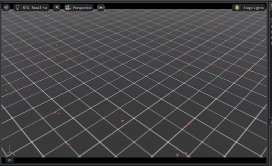

# 🚁 Phase 1: Quadcopter Stabilization & Hover

This environment represents the **foundation** of the project. The goal is to train a neural network policy to replace the traditional PID controller, learning the core dynamics of the Crazyflie 2.1 to maintain stable flight and reach local coordinates.

<p align="center">



<em>Trained policy correcting random initial perturbations and holding position.</em>
</p>

## 🎯 Task Objective

The drone spawns at the origin with a random target position  within a localized range.

* **Goal:** Minimize the distance to the target vector .
* **Constraint:** Maintain upright orientation and minimize energy (penalizing high angular velocities).
* **Termination:** * Crash (Height < 0.1m)
* Fly-away (Height > 2.0m)
* Timeout (10s)


## 🧠 Observation Space (Architecture Match)

The observation space has a size of **98 dimensions**.

⚠️ **Note on Zero-Shot Transfer:**
Only the first **12 dimensions** contain active data in this phase. The remaining **86 dimensions are zero-padded**.

* **Why?** This ensures the Neural Network architecture (`[input: 98] -> [hidden] -> [output: 4]`) is identical to the complex Phase 3 (Localization) environment.
* **Benefit:** We can load the weights trained here as a pre-trained backbone for the complex tasks later.

| Index | Name | Dimensions | Description |
| --- | --- | --- | --- |
| `0-2` | `root_lin_vel_b` | 3 | Linear velocity in body frame. |
| `3-5` | `root_ang_vel_b` | 3 | Angular velocity (gyroscope data). |
| `6-8` | `projected_gravity_b` | 3 | Gravity vector in body frame (IMU orientation). |
| `9-11` | `desired_pos_b` | 3 | Vector to the target position relative to the drone. |
| `12-97` | `PADDING` | 86 | **Zero-filled**. Reserved for LiDAR and Grid sensors in future phases. |


## 🎮 Action Space

Direct force and torque control (normalized ).

| Index | Component | Physical Mapping |
| --- | --- | --- |
| **0** | **Thrust** | Maps to total motor force . Scaled by `thrust_to_weight` (1.9). |
| **1** | **Roll Moment** | Torque around X-axis. Scaled by `moment_scale` (0.01). |
| **2** | **Pitch Moment** | Torque around Y-axis. Scaled by `moment_scale` (0.01). |
| **3** | **Yaw Moment** | Torque around Z-axis. Scaled by `moment_scale` (0.01). |


## 📉 Reward Function

The reward is dense and shaped to guide the agent towards the target smoothly.

1. **Position Reward (Tanh):** Encourages getting close to the goal without gradients exploding at far distances.


2. **Velocity Penalties:** Discourages erratic movements and shaking.


## 🚀 Training

This environment is lightweight and converges quickly.

**Configuration:**

* **Network:** MLP `[256, 256, 128]` (ELU activation).
* **Algorithm:** PPO (Proximal Policy Optimization).
* **Steps:** 24 steps per env per rollout.
* **Total Iterations:** 300 (Sufficient for hover mastery).

```bash
# Train the stabilization policy
isaaclab.bat -p scripts/reinforcement_learning/rsl_rl/train.py \
    --task=Isaac-Quadcopter-Direct-v0 \
    --num_envs 65536 \
    --headless

```

> **⚡ Performance Note:** Taking full advantage of the **NVIDIA RTX 5070 Ti**, we scaled the simulation to **65,536 (64k) parallel environments**. This massive parallelization allows the agent to experience millions of flight seconds in just a few minutes of real-time training.